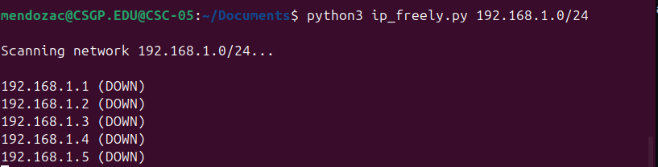
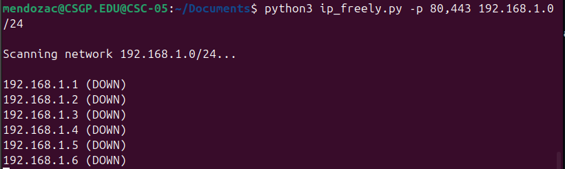

# Porthole 

Porthole is a Python-based network scanner that:

- Scans a network 
- Detects live hosts using ping
- Shows service names for open ports

---

## Requirements

- Python 
- Windows, macOS or Linux

---

## Example
Below is an example of the scanner working 

